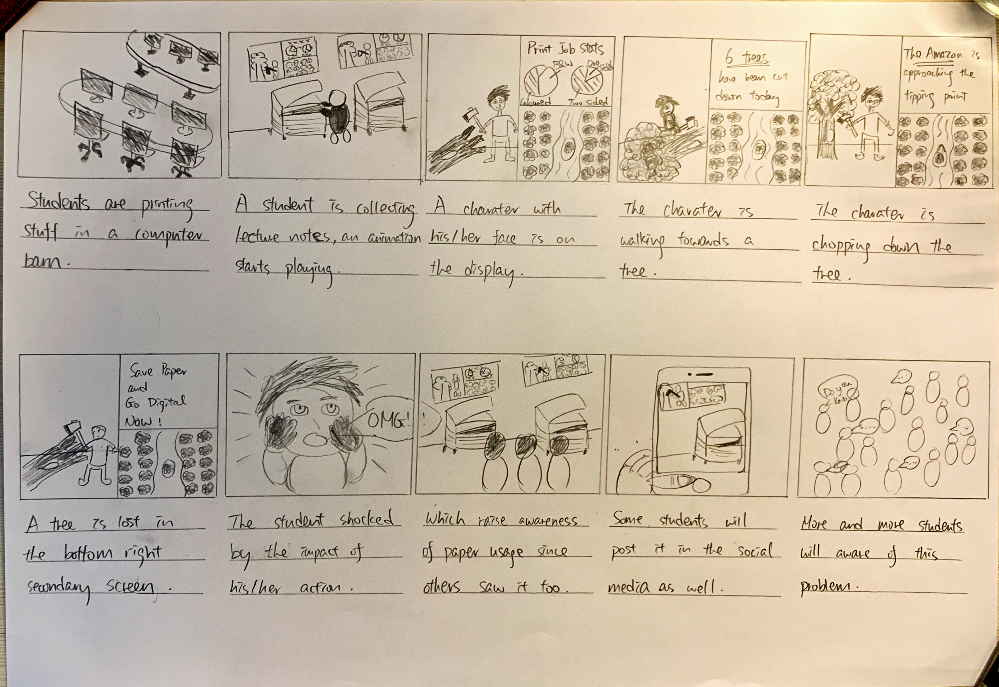

### Project Background

We observed that there is little to none reduce paper usage campaigns on campus, and the few that are related are unidirectional and dull. This comes as a surprise to us because we thought this would be an obvious place to start a sustainability campaign, especially since trees have an important role in nature's carbon cycle, hence the amount of trees is directly impacting our fight to save our planet. Therefore, we decided we would be the ones who start a tree-saving campaign.

### Project Goal

Our goal is to encourage all students to reduce unnecessary printing. To achieve that, we listed out four criteria, which are user-friendly, educational, impactful and feasible.

#### User-friendly

The advertisement has to seamlessly blend into our everyday routine to create the strongest impact. It should create too much of a hassle or else our target users would not have the patience to sit it through.

#### Educational

The campaign has to have a strong message and let target users clearly understand the reasoning behind.

#### Impactful

Ideally, the campaign should create a powerful positive/negative reinforcement to encourage target users to associate his/her action to the environmental impact.

#### Feasible

The idea should be not only viable, but also straightforward and economical to implement so that university students can turn it into reality.

### Execution

#### Brainstorming Session



After a 2-hour long brainstorming session, we finally come up with 5 proposals.

1. Design a simple and intuitive green button for users to click to adopt a more sustainable way of printing
2. Create multiple storylines for printing options and let users navigate various ways to print less and print more sustainably
3. Share notes among the student body to reduce repetitive one-time note printing for exams for the same course
4. Records how much each student has printed and then make a scoreboard to show people who print less
5. Visualise the printing behaviour is equivalent to cutting down trees and make people more aware of the environmental consequences behind their printing

#### Storyboards



After we reviewed all 5 proposals, we decided to go with proposal 5 since it fits our pre-defined criteria the best. The others are rejected because it is either not impactful enough or not feasible. The graph below is its storyboard, which demonstrated the use case and what we envisioned it would achieve.

We will have a display spat into three, half of it will play the wood chopper animation, a quarter of it will display a forest from the bird's-eye view, and the remaining quarter of it will display messages and statistics.

Since it is a campaign to raise awareness, we are planning to install it at the computer barn to maximise the impact. Here is the use case,

1. User clicks the print button in the printer
2. While waiting for the documents to be printed, the woodchopper animation will be played
   1. A woodchopper with the previous user's face is standing next to a chopped tree
   2. The woodchopper is walking towards a new tree on his left, we change his face to the current user's face when he walks past the chopped tree since his face will be temporarily blocked
   3. The woodchopper approaches the new tree
   4. The woodchopper chops the new tree
   5. Repeat when a new user clicks the print button in the printer
3. One tree in the bird's-eye view will be removed
4. Update statistics in the slideshow

#### Prototype



We included all three separate animations on a webpage to simulate our product and invited our friends to give us feedback. They all agree it is an impactful campaign that can raise awareness of the over-printing problem on campus. 

### Reflection

This project taught me the importance of interactive design and provides hands-on experience on the workflow of ideation.

