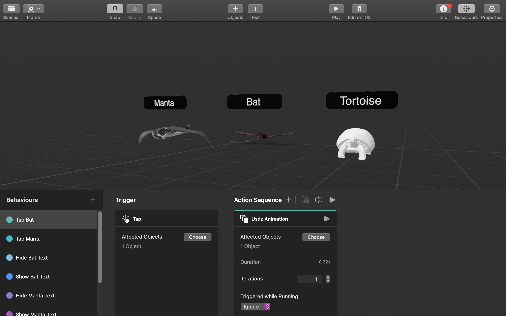
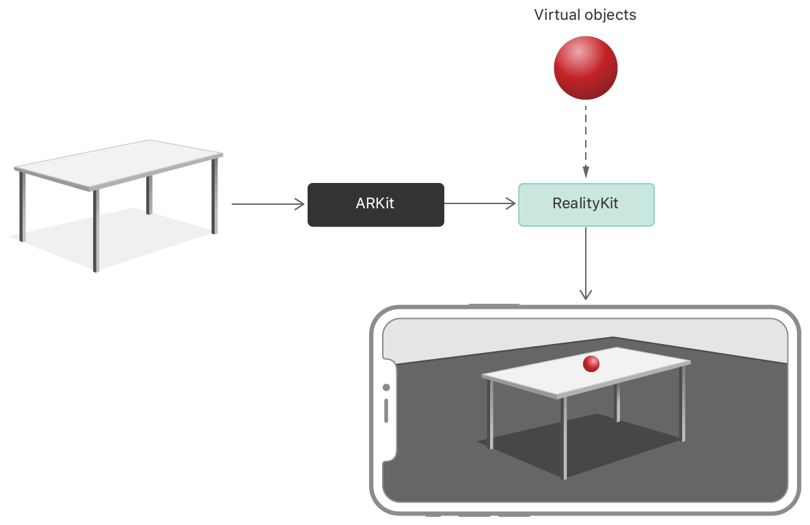

### Background

We identified that textbooks have been the essential knowledge carrier throughout our history. It has educated and inspired generations and generations of students. However, the nature of a book has been more or less the same from the time it was invented. By combining with AR technology, textbooks can become more interactive and immersive, which brings more joy and exciting experience to kids.

### Process

#### Mindmap

We have two major ideas on implementing AR in paper products. The idea we chose are aiding kids (especially the ones with special education need) to learn. They usually suffer from lack of concentration and refuse to engage in a classroom setting. With AR application they will be more engaging not only in class but also after class as the animations with catching their attention, which in results yield a better learning experience. The other idea is to place the 3D model on top of magazine advertisements, ideally a piece of jewellery, so that the user can see it in detail and even try it on.

### Results

#### Prototype



I implemented this prototype with Apple's RealityKit. First, with the help of our group mate Taylor, we found several related 3D models on Sketchfab to work with. Next, we need to have them ready in `.usdz` file format so that we can manipulate it in Apple's framework. However, the object files' format differs since they are uploaded by different authors. Using a community's command line tool [gltf2usd](https://github.com/kcoley/gltf2usd) and Apple's `usdzconvert` command line tool, we can port the models to `.usdz` and use Reality Composer to build the scene.

Material properties, behaviours and even physics can be edited in Reality Composer.

Behind the scene, ARKit detects horizontal planes to construct the real world while RealityKit combines the real world and virtual world. RealityKit then can alter objects in the reality composer and trigger behaviours previously defined.

### Contribution

I contributed the most in the prototype part as I am more familiar with the technology behinds it. I am also the one who made the video prototype. Since only Unity was taught in class, essentially I have to read the documentation by Apple as my sole source of information. Credits to their well-written documentation and clear video tutorials, I picked up the skills in no time. I have also involved in our design process especially when we were brainstorming. Working with this group is a breeze as everyone is willing to contribute voluntarily in this midterm season.

### Reflection

The RealityKit and Reality Composer are unveiled in WWDC 2019 in June and are released the public version in September. As an iOS developer, it is a great opportunity for me to learn a new Apple framework. This project itself has a tight schedule which pushes us to be as effective as we can.