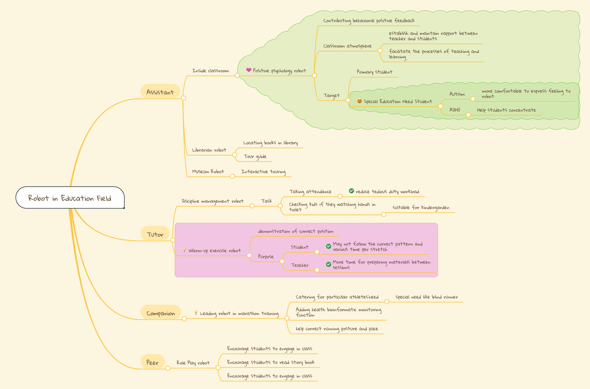
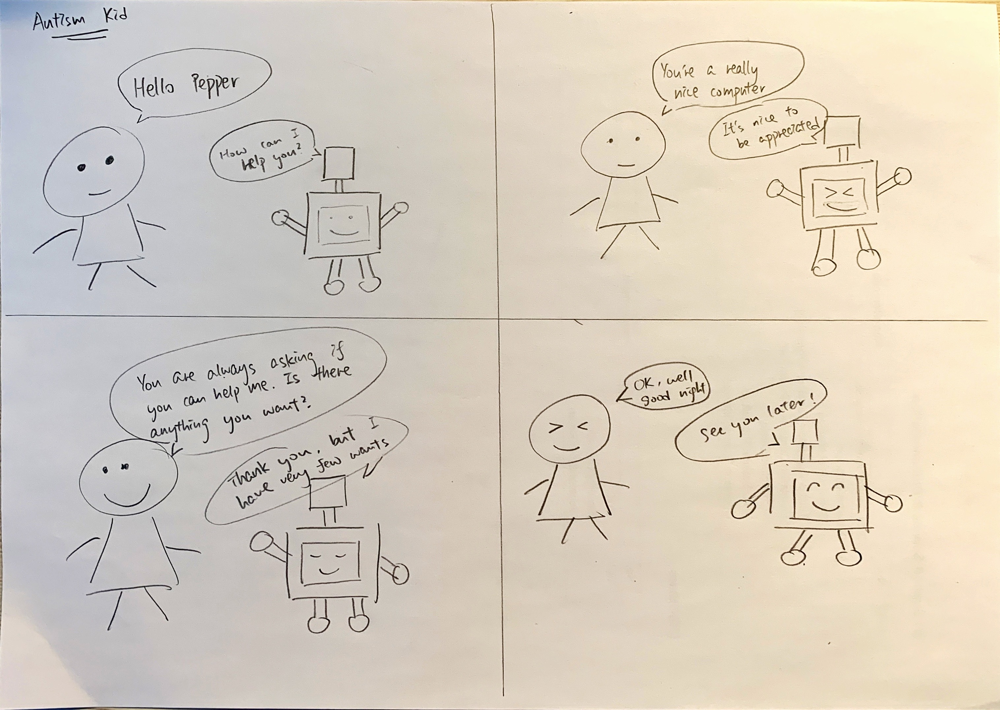
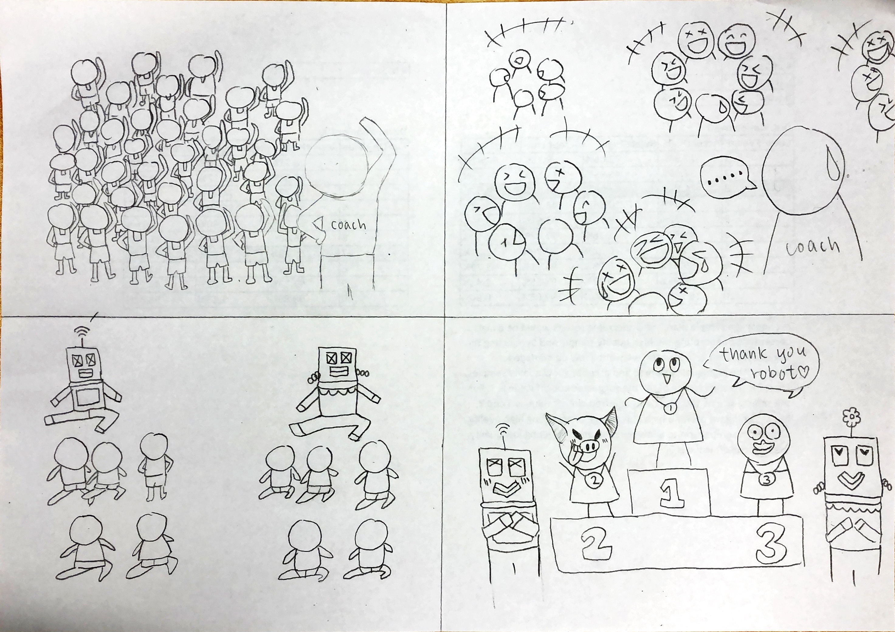
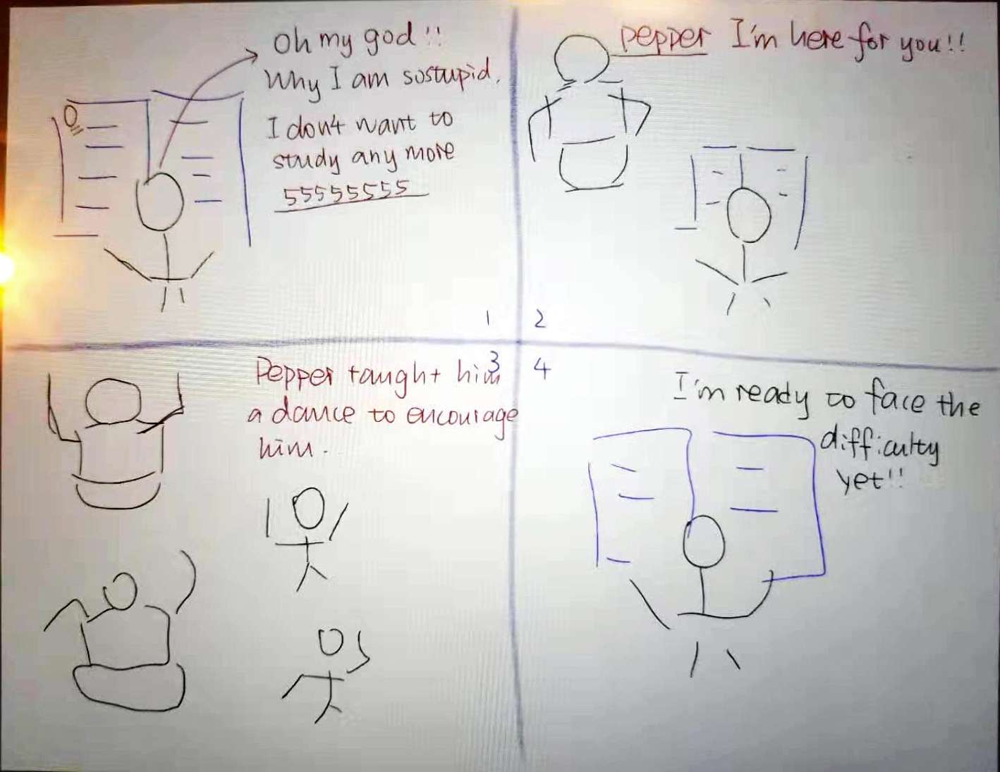

### Background

We observed that people are not that into robots behaving very human-like as they found that creepy. However, they found it enjoyable to interact with a simple but useful robot. This counter-intuitive reaction could be explained by we like to treat robots as pets, since dumb robot does not threaten human beings.

### Process

#### Mindmap

We have come up with a few ideas on robot in education field. I proposed that we can teach autism kid communication skills by having the robot to interact with them. Some other great ideas are robot that leading warm-up exercise for kids, and robot that cheer you up when you are under stress. We finally picked the last idea, as we all can use a good laugh in this time.

#### Storyboard

This is the storyboard of my idea,

1. An autism kid initiates a conversation with Pepper.
2. Pepper answers politely with facial expression.
3. Kid learns social skills and facial expression from Pepper.
4. The conversation can be ended whenever the kids want, and starts again as they please.

The rationale behind it is that despite the common belief that children with autism prefer to be alone, they do feel lonely and crave for companionship. By teaching them to communication with others properly and guide them to read facial expressions, they can learn the basic interpersonal skills that might assist them to form a friendship.

I conduct the speed-dating process with Austin, who is a social worker. He replied that it is a great tool for helping autism kids to socialise, though it might be hard to render the correct facial expression.

Here are storyboards from my other group mates,

### Results

#### Prototype



While we were filming the prototype, we experienced the delicacy of this robot our TA mentioned first-hand. Our test user's feedback is, to our surprise, loving how silly the robot dance. In a way there is even more humour in it. Since our end goal is to help our users to relief from stress, this will do just fine.

### Reflection

I have seem these two robots in news before but I have never interacted with nor coded them. After the workshop and this project, I learned that programming these robots are actually easier than I thought.

### Full Presentation



For the presentation video, I put all different voice-overs together and merge them with the slides video. 